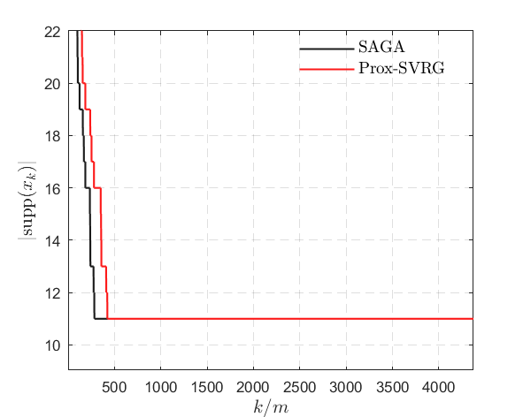
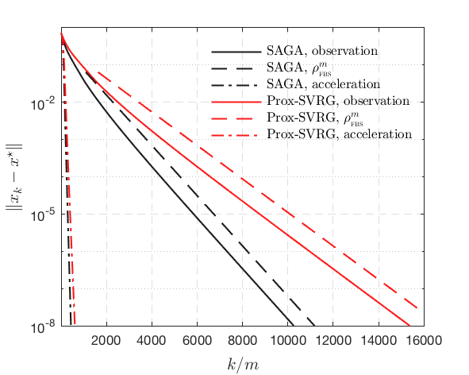

# Local Convergence Behaviour of SAGA/ProxSVRG

Matlab code to reproduce the results of the paper

Local Convergence Properties of SAGA/Prox-SVRG and Beyond

Clarice Poon, Jingwei Liang, Carola-Bibiane Schönlieb

## Prox-SGD has no manifold identification

## When non-degeneracy condition fails

Solution and its dual          |  Support identification of three different initial points
:-------------------------:|:-------------------------:
  |  -LASSO.png)

## Sparse Logistic Regression

Support identification of SAGA/Prox-SVRG          |  Local linear convergence of SAGA/Prox-SVRG
:-------------------------:|:-------------------------:
  |  

Copyright (c) 2018 Clarice Poon and  Jingwei Liang