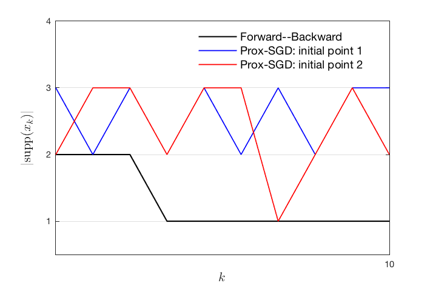
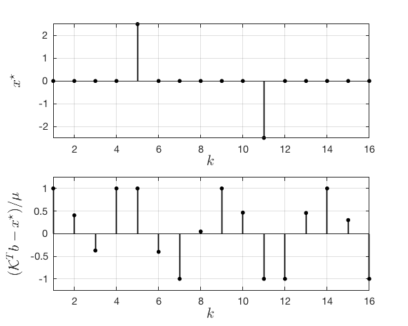
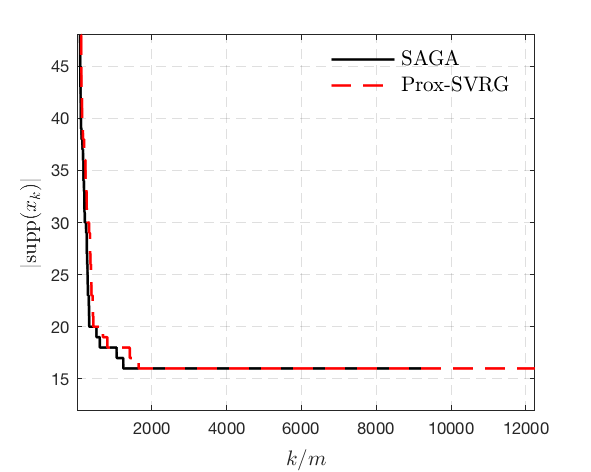
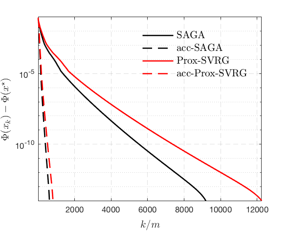
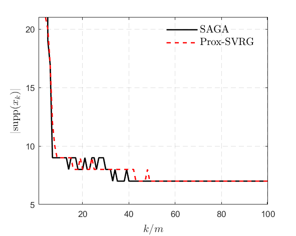
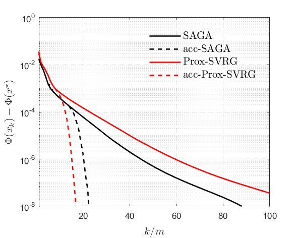

# Local Convergence Behaviour of SAGA/ProxSVRG

Matlab code to reproduce the results of the paper

[Local Convergence Properties of SAGA/Prox-SVRG and Beyond](http://proceedings.mlr.press/v80/poon18a.html)

[Clarice Poon](http://www.damtp.cam.ac.uk/user/cmhsp2/), [Jingwei Liang](https://jliang993.github.io/), [Carola-Bibiane Schönlieb](http://www.damtp.cam.ac.uk/user/cbs31/Home.html), 2018

## Prox-SGD has no manifold identification

## When non-degeneracy condition fails

Solution and its dual          |  Support identification of three different initial points
:-------------------------:|:-------------------------:
  |  -LASSO.png)

## Sparse Logistic Regression

### Toy example

Support identification of SAGA/Prox-SVRG          |  Local linear convergence of SAGA/Prox-SVRG
:-------------------------:|:-------------------------:
  |  

## LASSO

Support identification of SAGA/Prox-SVRG          |  Local linear convergence of SAGA/Prox-SVRG
:-------------------------:|:-------------------------:
  |  

Copyright (c) 2018 Clarice Poon and  Jingwei Liang